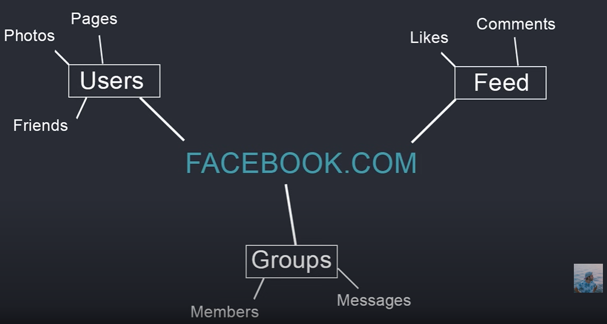

## Overview 

## Apps
Apps are small pieces of of your project that make up the website you are making. They are supposed to represent different parts of a website. For insance, consider this graphic from [Dennis Ivy](dennisivy.com) that depicts how Django apps could look like for Facebook.:

One of the apps represents all of the Users and the actions they could perform on the site that relate back to the database actions you would need to ensure were performed. Same thing for Feed, Groups, etc.

Apps usually contain:

- Database Models
- URLs
- [Views](SELFRENCING LINK HERE)
- Templates

### Views
Views are the thing that processes a user's requests made on the website. These are typically defined as classes or functions.

## HEADER

