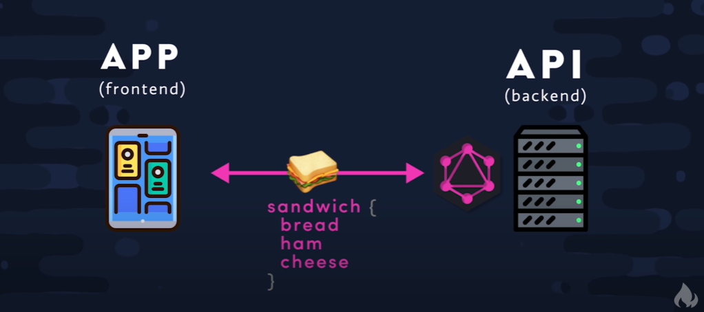
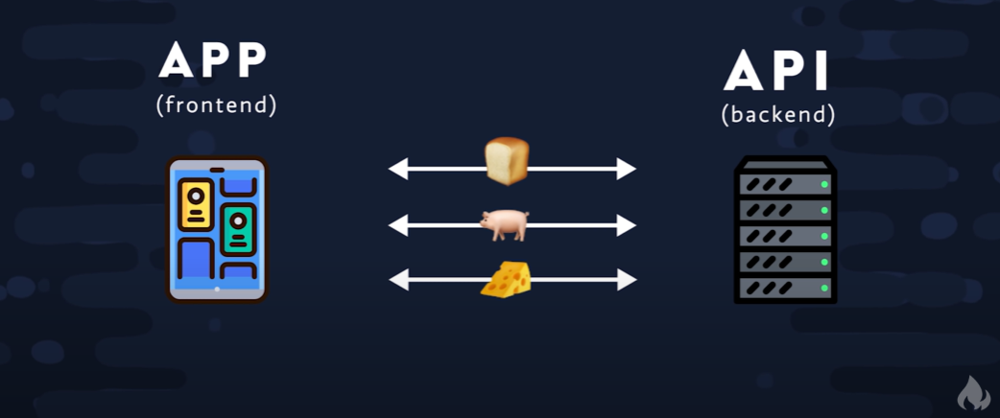

## Overview
GraphQL is a query language for APIs. In essence, it allows your front end apps to talk to your backend apps and consistently request data from your frontend to your backend in a very "surgical" manner and thus avoiding large chunks of database objects.

Think of it like if your frontend wanted to request a sandwich from your backend. If you have GraphQL acting as the "middleman" between the two, you can request the specific ingredients of a sandwich as pictured below (credit: [Fireship.io](https://fireship.io)):

Conversely, when using a diferent middleman, such as Rest, your frontend will have to make a request for an **entire** loaf of bread, an **entire** wedge of cheese, and an **entire** pig, leaving your frontend to figure out how to deal with making those **whole** ingredients into a single sandwich. See the figure below (credit: [Fireship.io](https://fireship.io)): 

GraphQL achieves this by using resolvers.

## Resolvers
Resolvers are functions that fetch or compute data for a field in your schema. Think of the resolver asbeing like a waiter in a restaurant: after making an order (a query) to your waiter after looking at the menu (which is your schema), the waiter will go to the kitchen and fetch exactly what you ordered. Nothing extra.

## Queries and Mutations